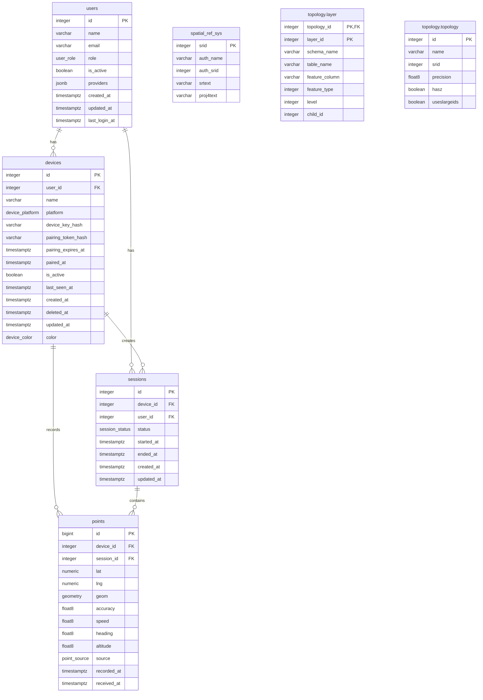

# Database Schema: alzy

## Enumerated Types

### device_platform
- android
- ios
- web

### device_color
- blue
- green
- red
- yellow
- purple
- orange
- pink
- gray

### session_status
- active
- ended
- paused

### user_role
- user
- admin

### point_source
- gps
- network
- fused
- manual

## Relationships

1. **users → devices** (1:N): One user can have multiple devices
2. **users → sessions** (1:N): One user can have multiple sessions
3. **devices → sessions** (1:N): One device can create multiple sessions
4. **devices → points** (1:N): One device can record multiple points
5. **sessions → points** (1:N): One session can contain multiple points
6. **topology → layer** (1:N): One topology can have multiple layers

## Notes

- The database uses PostGIS for spatial data (geometry types)
- Soft deletion is implemented via `deleted_at` timestamp
- Timestamps use timezone-aware timestamps (`timestamptz`)
- JSONB is used for flexible provider data in users table
- Custom enumerated types are used for platform, color, status, role, and source